# Introduction

    

    Image/Video editing tools and applications have been widely used in many areas, including marketing, fashion design, and film production. Among these applications, we are especially interested in Image Completion, and think it is an important function. Why is Image Completion important? Actually, it is very useful for lots of purposes. No matter it’s for everyday photo or movie post-processing, it can help you remove objects you don’t want (see Fig1 and Fig2).
    

    

        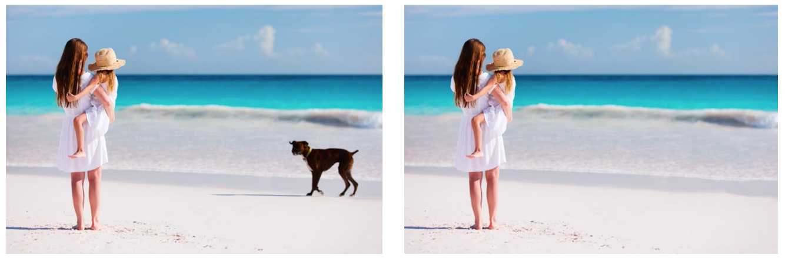
        
<b>Figure 1:</b> <i>Everyday Photo</i>

        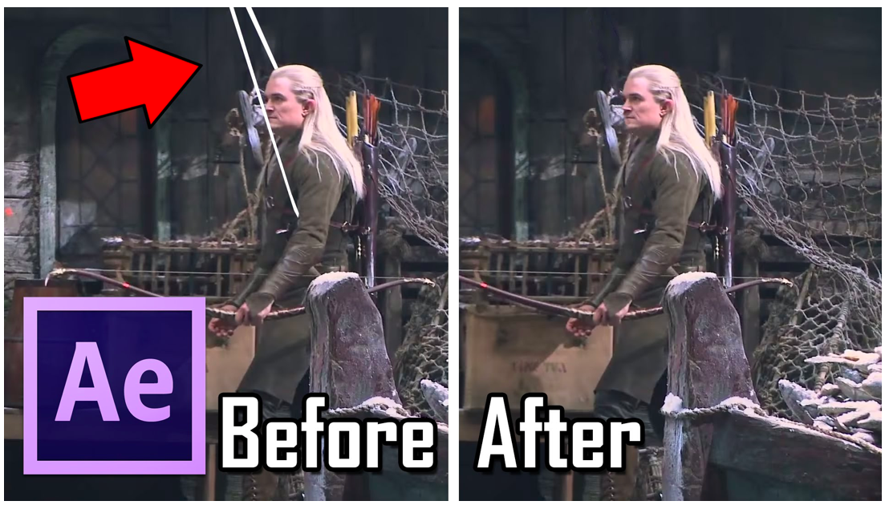
        
<b>Figure 2:</b> <i>Movie Post-Processing</i>

    

# State-of-the-Art

    

    We survey the literature works. The latest one is from SIGGRAPH 2017 (see Fig3), which is based on deep neural network. 
    

    

        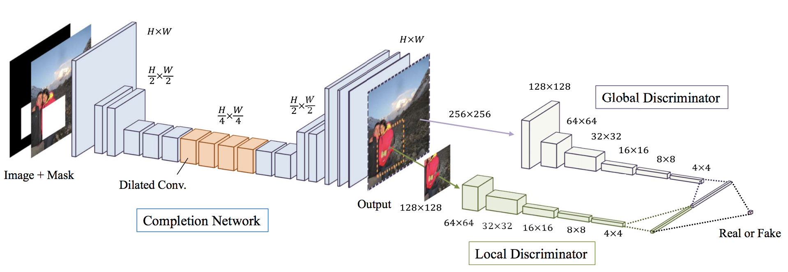
        
<b>Figure 3:</b> <i>Deep convolutional neural networks</i> [1]

    

    

    Although this work is very powerful, it may still fail in some cases (see Fig4). We also find other problems with this model. Usually, It takes lots of time and images to train a model. Also, it doesn’t provide an interactive way for users to improve results if they are not good enough.
    

    

        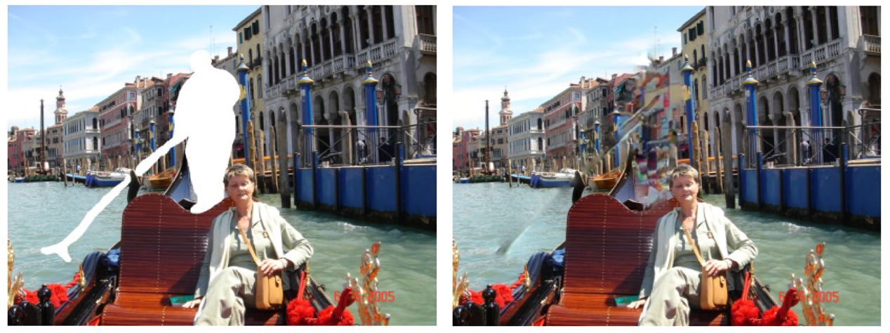
        
<b>Figure 4:</b> <i>Failed case in</i> [1]

    

# Adobe Photoshop: Content Aware Fill (PatchMatch)

    

    Thus, we’re more interested in what’s the industry solution for this problem since we usually ask for a higher standard of image quality provided by those market products. We find that Adobe Photoshop also has this function which is called Content Aware Fill (see Fig5) using PatchMatch algorithm [2]. So, we try to find some insights from this algorithm.
    

    

        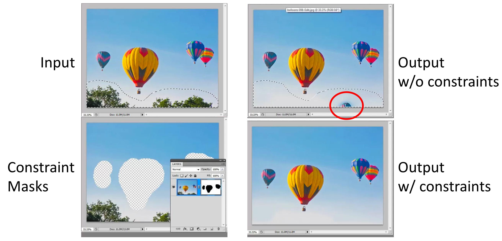
        
<b>Figure 5:</b> <i>Adobe Photoshop: Content Aware Fill</i>

    

# PatchMatch 
## Algorithm

    

    The purpose of the PatchMatch algorithm is to efficiently find the similar patches between two images. Basically, its algorithm contains three steps: random initlization, propagation, and random search (see Fig6).
    

    

        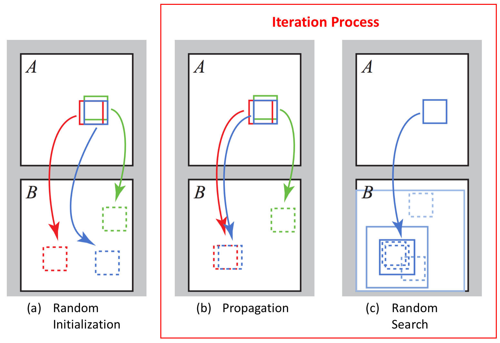
        
<b>Figure 6:</b> <i>PatchMatch Algorithm</i>

    

    

    Take Fig7 as example. For each patch in A, we try to find a similar patch in B. In the fist step, we randomly match each patch in A with a patch in B. If we’re lucky, we may get some pairs already similar enough. Then, in the second step, we check if our neighbors can give us a better candidate patch. If it is, we just propagate this benefit, i.e., just update the patch. In the final step, we continue looking for a better patch in our neighborhood by random search in order to get out of a local optimum.
    

    

        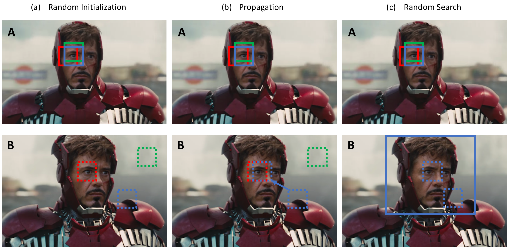
        
<b>Figure 7:</b> <i>Example of PatchMatch Algorithm</i>

    

## Simulation Result

    

    Here is the simulation results (see Fig8). You can see how fast this algorithm is. Even for the first iteration, we can almost reconstruct the image just using pixels from B. Then, after that, each iteration just gets the result sharper and sharper.
    

    

        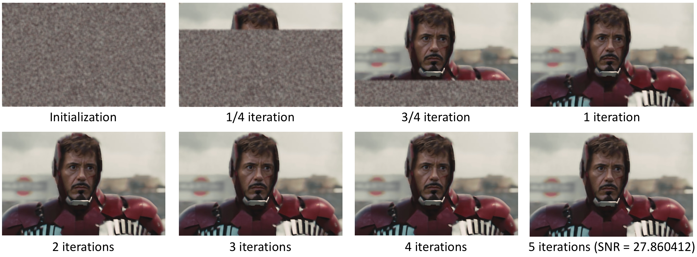
        
<b>Figure 8:</b> <i>Simulation Results of Different Iterations</i>

    

    

    In addition to the subjective evaluation, we also calculate its SNR score, which shows how similar two images look like. According to the SNR formula below, we calculate 27.860412 as the SNR score, which also shows that the original image and the final result are very similar based on the criteria of ISO 12232: Electronic Still Picture Cameras.
    

    

        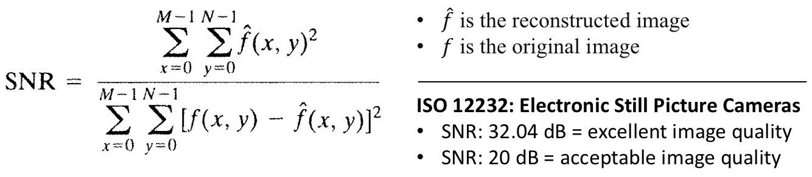
        
<b>Figure 9:</b> <i>SNR Formula and ISO 12232 Criteria</i>

    

# Image Completion
## Task Definition

    

        Image completion/inpainting is used when there is corrupted or unwanted region in image and we want to fill those region with
        pixels that are coherent with the background. Below is an illustration, say we want to remove the cow in the image, we will
        done that by remove the cow from image and try to complete it.
    

    

        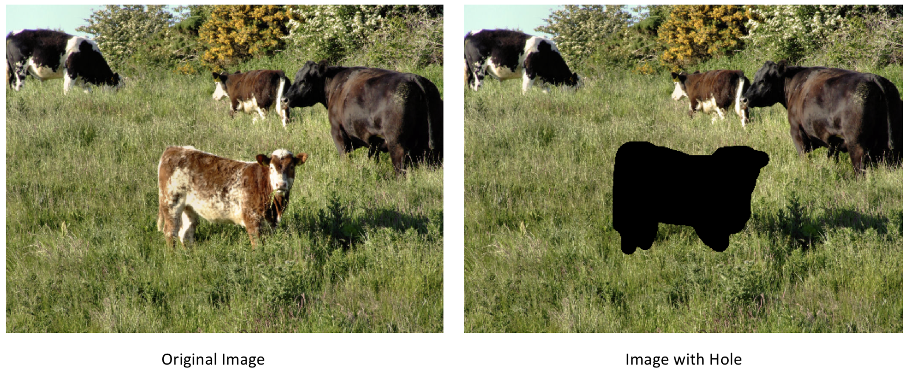
        
<b>Figure 10:</b> <i>Image Completion Task Definition</i>

    

## First try

    

        To use patchmatch for image completion, we come up with this straight forward method.
        First, find a bounding box of the missing region.
        Then for each patch in the bounding box, we try to find the nearest patch outside the bounding box use PatchMatch.
        Finally, we just use those nearest patches to vote for the pixel value inside the missing region.
    

    

        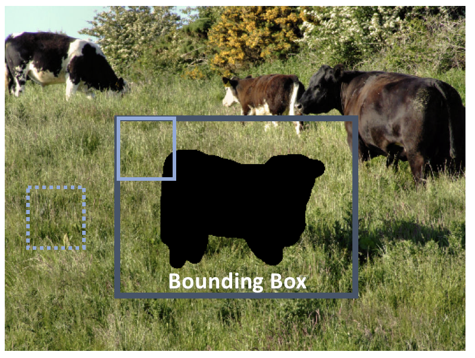
        
<b>Figure 11:</b> <i>Algorithm of First Try</i>

    

    

        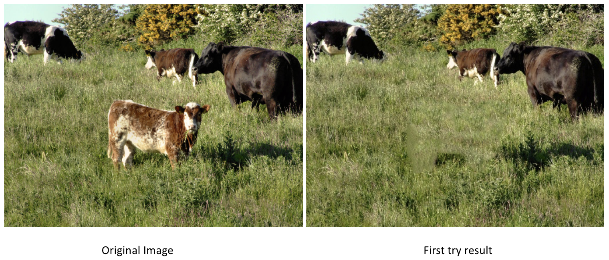
        
<b>Figure 12:</b> <i>Result of First Try</i>

    

## What's the problem?

    

        We can observe that there are some blurred region of the result in Figure 12. It is because the nearby pixels in the
        missing region are not finding coherent nearest neighbor patches. When those patches voting for the pixel, they give
        different votes and averaging them yields blur region.
    

    

        So how can we find better nearest neighbor patches?
        Turns out that we want patch size to be large enough in the first hand to see the global picture of the image.
        Meanwhile, we also want it to become small enough in the end so that our algithm can be aware of local structure
        and produce sharp image. The answer to that is adaptive patch size, or we can done that by fix patch size and varying
        the image size in multiple scale.
    

## Multi-Scale Image Completion

    

        We use multi-scale image completion, as described in [3].
        We start from the smallest scale, do image completion at that scale, then keep scaling up until we meet the original scale.
        In each scale change, for the pixels outside the missing region, we simply scale down the original image to that scale;
        for the pixels inside the missing region, we scale up the filled region as initialization of next scale.
    

    

        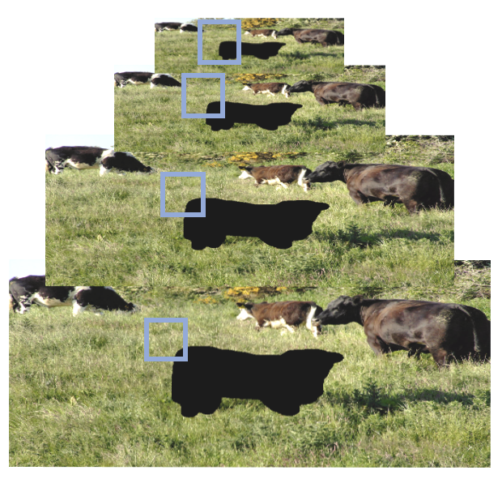
        
<b>Figure 13:</b> <i>Algorithm of Multi-Scale Image Completion</i>

    

    

        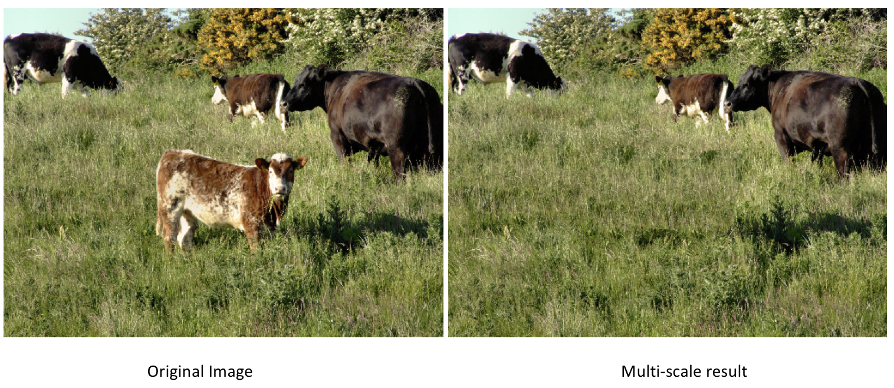
        
<b>Figure 14:</b> <i>Result of Multi-Scale Image Completion</i>

    

## Incorporating Constraints

    

        However, sometimes it still produce images with artifacts, like the left image of Figure 17.
        Luckily, there is a solution. We follow [1] to incorporate user-specified constraints to enhance the completion result.
        To do that, we simply restrict the constrained pixels in missing region to search for patches that are of same constraint.
    

    

        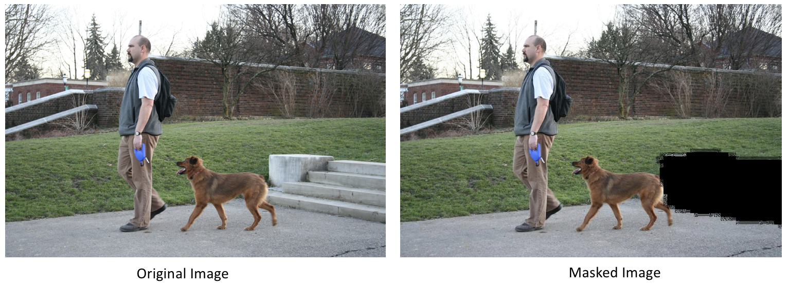
        
<b>Figure 15:</b> <i>Man and dog image</i>

    

    

        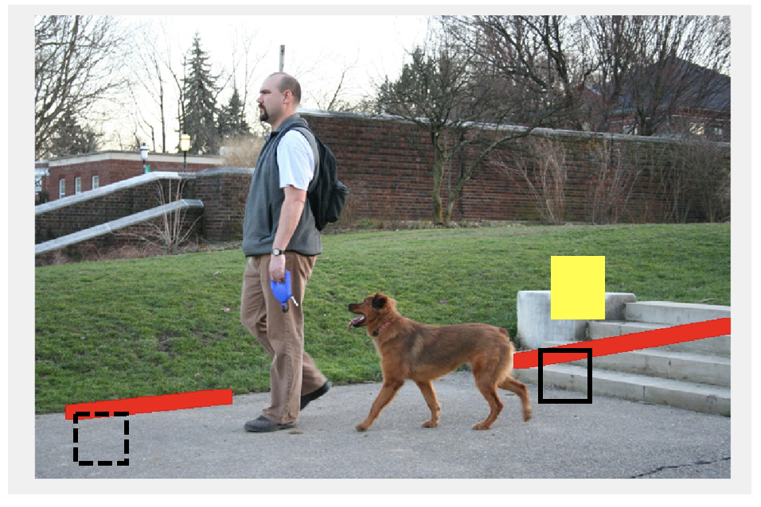
        
<b>Figure 16:</b> <i>User-specified constraint</i>

    

    

        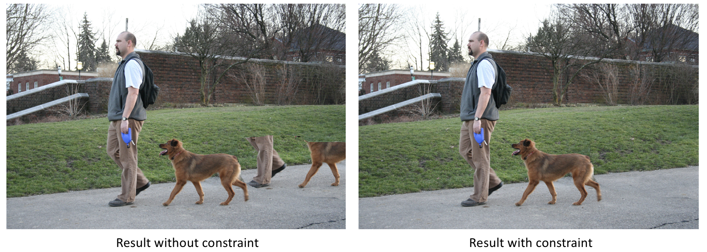
        
<b>Figure 17:</b> <i>Image completion result of man and dog</i>

    

# Interactive GUI

    

    We designed an interactive GUI for end users. User can load an image and mask for that image. Then he/she can introduce some contraints to maintain some boundaries and let the algorithm complete the hole in the image. Using our imterative interface user can improve the performance of image completion. For a short demonstraion please watch the video below.         
    

        

# Image Completion Results

    

        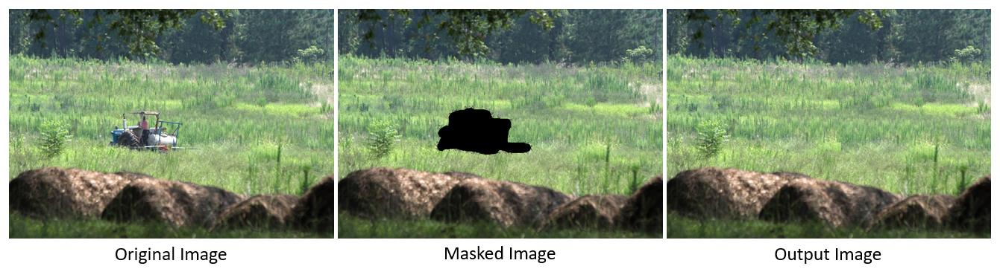
    

    

        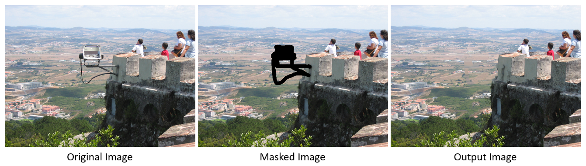
    

    

        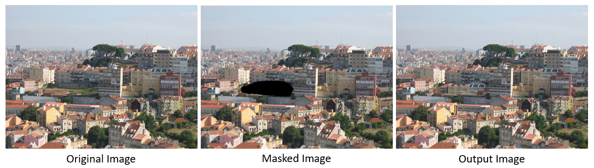
    

    

        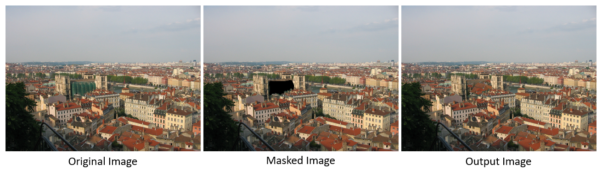
    

    

        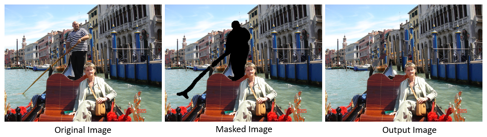
    

# Future Work
1. Adopt KNN rather than the most similar patch
2. Figure out a way for better initialization
3. Find how to determine patch size
4. Speed up our application to real time
5. Improve the sensitivity issues for initialization and patch size

# Presentation
[Slides](https://docs.google.com/presentation/d/1YMoPjG7pNWLSEDjNDadcxzCkqFpysvW_enfNe-DhoVM/edit#slide=id.p1)

# Source Code
[Code](https://github.com/WenFuLee/CS-766-Computer-Vision)

# Reference
1. Iizuka, S., Simo-Serra, E., & Ishikawa, H. (2017). Globally and locally consistent image completion. ACM Transactions on Graphics (TOG), 36(4), 107.
2. Barnes, C., Shechtman, E., Finkelstein, A., & Goldman, D. B. (2009). PatchMatch: A randomized correspondence algorithm for structural image editing. ACM Transactions on Graphics-TOG, 28(3), 24.
3. Wexler, Y., Shechtman, E., & Irani, M. (2007). Space-time completion of video. IEEE Transactions on pattern analysis and machine intelligence, 29(3).
4. Hays, J., & Efros, A. A. (2007, August). Scene completion using millions of photographs. In ACM Transactions on Graphics (TOG) (Vol. 26, No. 3, p. 4). ACM.
